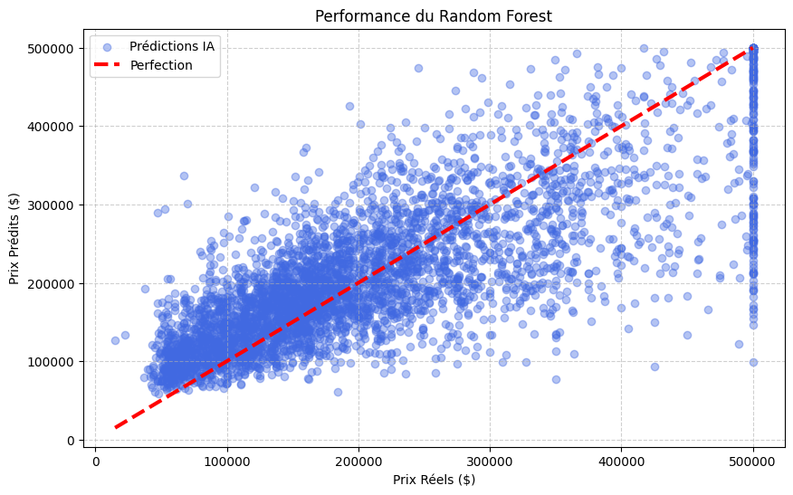

# 🏠 California Housing Price Prediction


> An End-to-End Machine Learning project developed within the **GDG Club Sup'Com** (Google Developer Groups), under the supervision of **Tesnime Ellabou**.

## 📌 Project Overview
The goal of this project is to build a regression model to predict the median house value in Californian districts. This project follows a rigorous Data Science lifecycle: from data exploration to model deployment.

We utilized the **California Housing Dataset** (1990 census data) to analyze features such as median income, housing age, and location.

## ⚙️ Key Features & Methodology
The project is structured around a robust **Scikit-Learn Pipeline**:

1.  **Data Cleaning**: Handling missing values and ensuring data integrity.
2.  **Feature Engineering**: Selection of the most relevant features (`median_income`, `housing_median_age`, etc.).
3.  **Preprocessing**: Standardization of numerical data using `StandardScaler`.
4.  **Modeling**:
    * *Baseline*: Dummy Regressor (for comparison).
    * *Linear Model*: Linear Regression.
    * *Ensemble Model*: **Random Forest Regressor** (Selected Model).
5.  **Evaluation**: Using **MAE** (Mean Absolute Error) and **RMSE** (Root Mean Squared Error).

## 📊 Results & Visualization
The **Random Forest Regressor** outperformed the Linear Regression model, capturing non-linear relationships in the data.


*Figure 1: Comparison between Actual Prices (X-axis) and Predicted Prices (Y-axis). The alignment with the red dashed line indicates high accuracy.*

> **Insight:** The horizontal line at the top ($500k) represents the data capping present in the original dataset.

## 🛠️ Tech Stack
* **Language:** Python
* **Data Manipulation:** Pandas, NumPy
* **Machine Learning:** Scikit-Learn (Pipelines, RandomForest, Metrics)
* **Visualization:** Matplotlib
* **Persistence:** Joblib (Model saving)

## 🚀 How to Run the Project
To reproduce the results on your local machine:

1.  **Clone the repository:**
    ```bash
    git clone [https://github.com/HelaSegni/california-housing-prediction.git](https://github.com/HelaSegni/california-housing-prediction.git)
    cd california-housing-prediction
    ```

2.  **Install the dependencies:**
    ```bash
    pip install pandas numpy matplotlib scikit-learn joblib
    ```

3.  **Run the script:**
    ```bash
    python main.py
    ```

## 👤 Author
**Hela Segni**
* Engineering Student at **Sup'Com**
* Member of **GDG On Campus Sup'Com**

---
